# flutter-financial-app

Prueba técnica – Gestión de Fondos BTG (financial-app), construidas con BLoC, Drift y Clean Architecture.

Arquitectura de **monorepo con Melos**, Clean Architecture por feature y soporte para Mobile, Web y Desktop.

## 🌐 Demo en vivo

**Web App (financial-app):** [https://andresroviram.github.io/flutter-financial-app/](https://andresroviram.github.io/flutter-financial-app/)

La aplicación está desplegada automáticamente en GitHub Pages mediante GitHub Actions.

## Screenshots

### Mobile (Light Theme)
<br>
<p align="center">
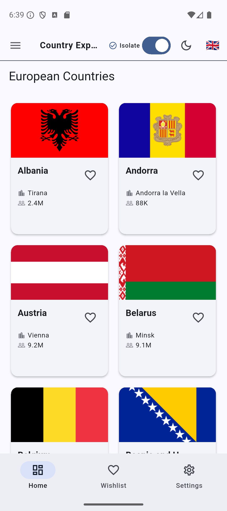
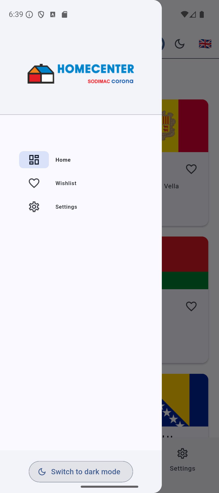
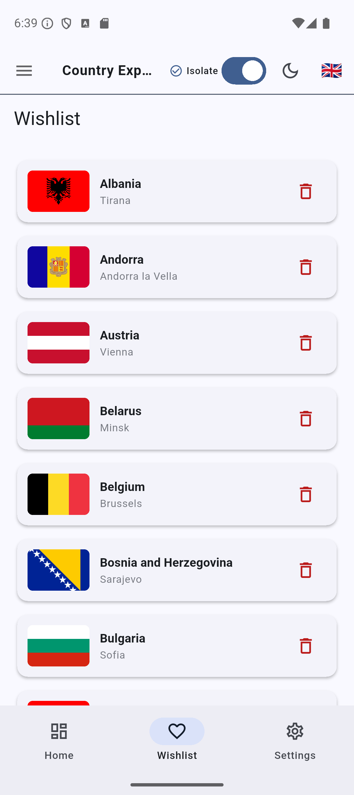
</p>

### Mobile (Dark Theme)
<br>
<p align="center">
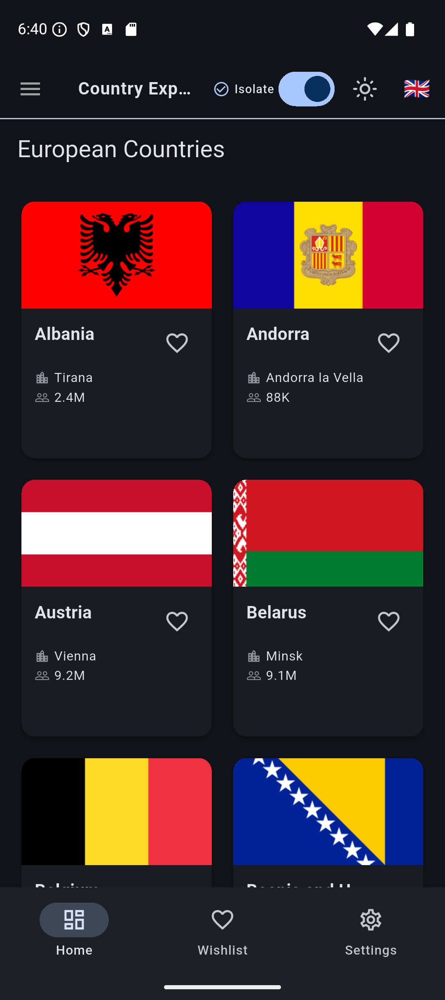
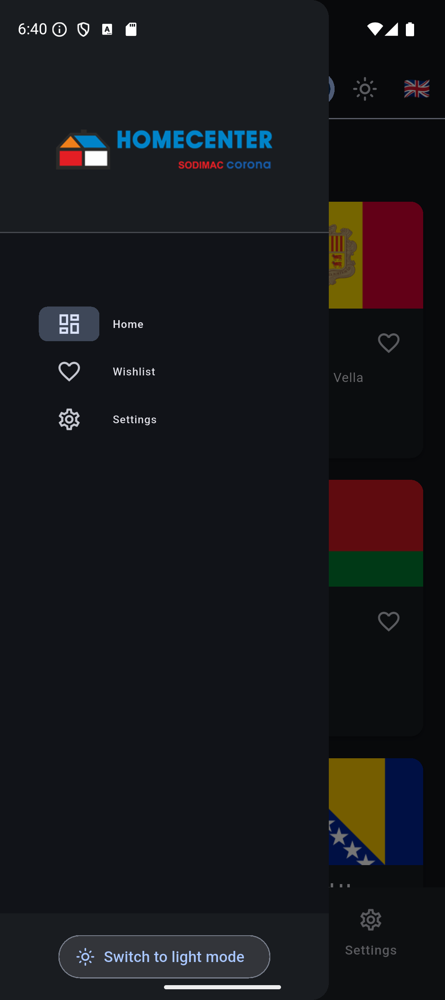
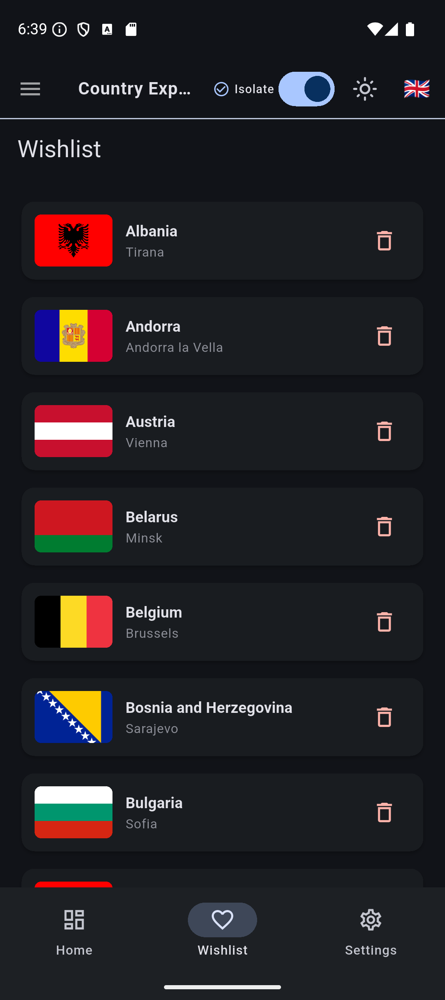
</p>

### Web (Light Theme)
<br>
<p align="center">
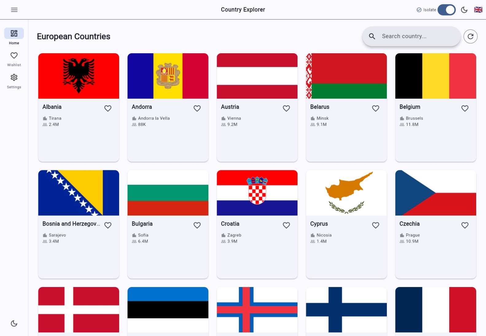
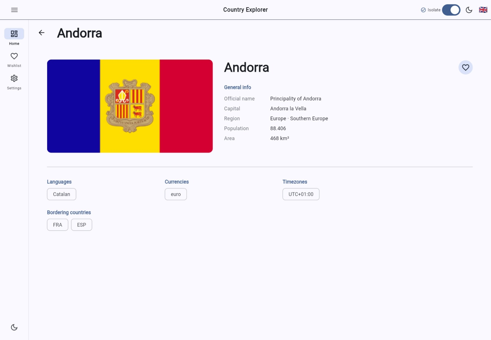
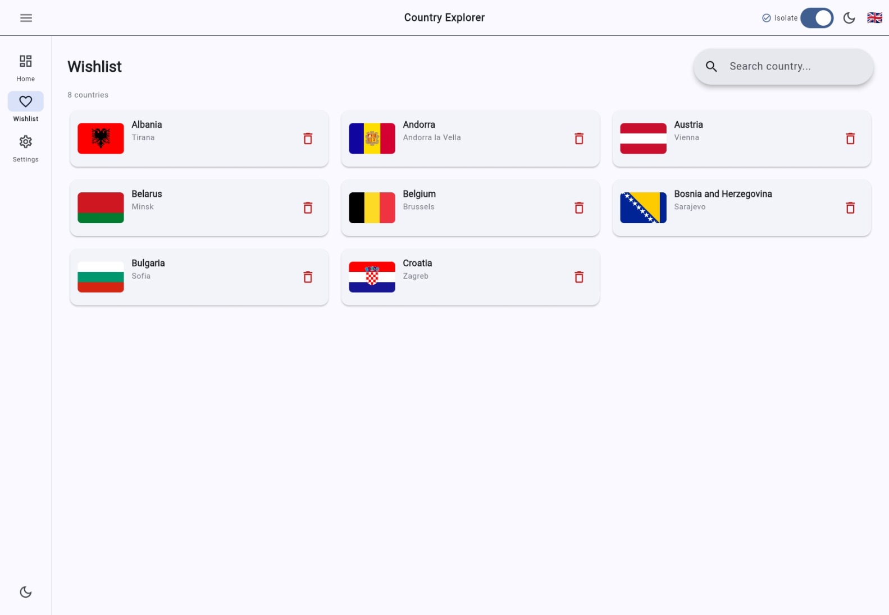
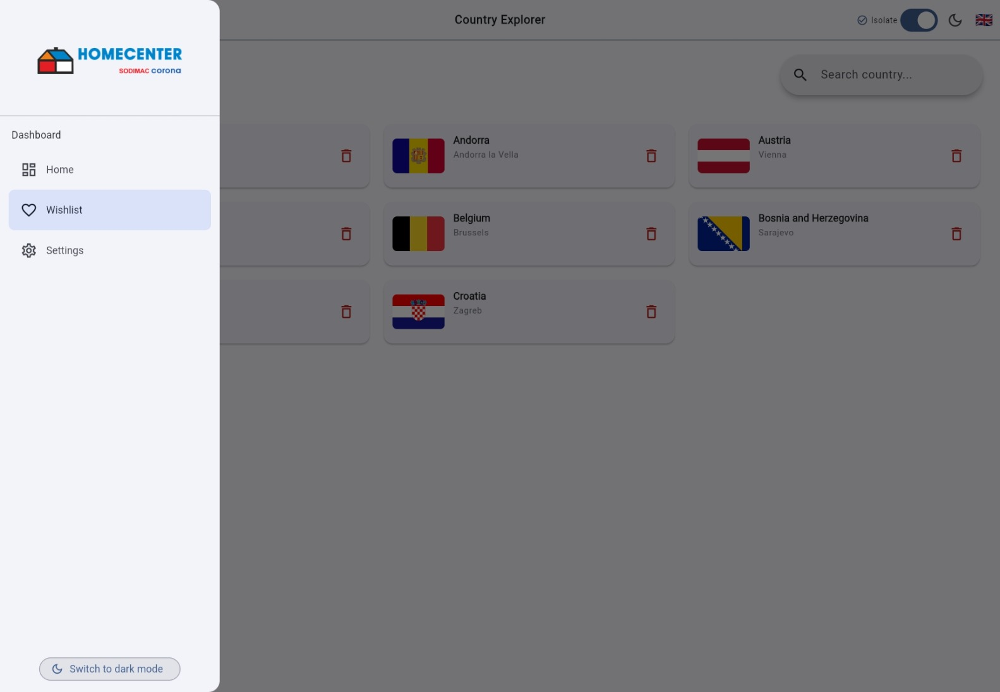
</p>

### Web (Dark Theme)
<br>
<p align="center">
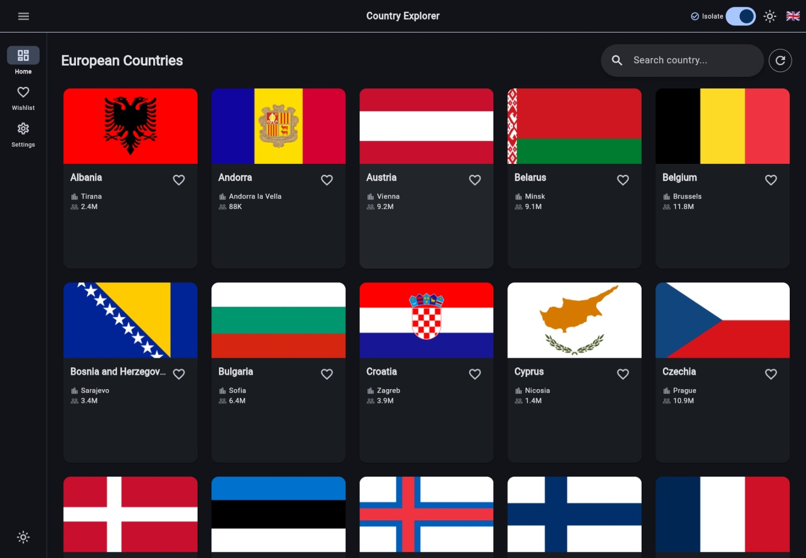
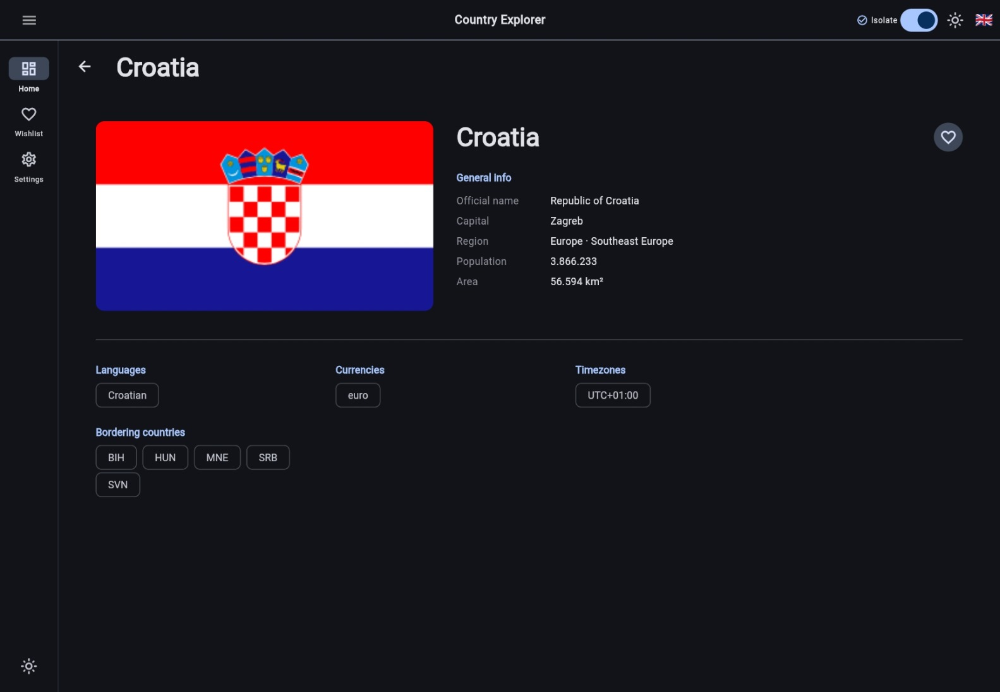
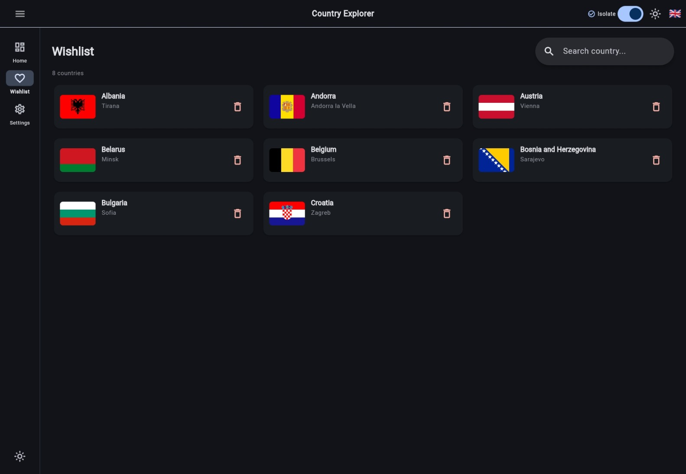
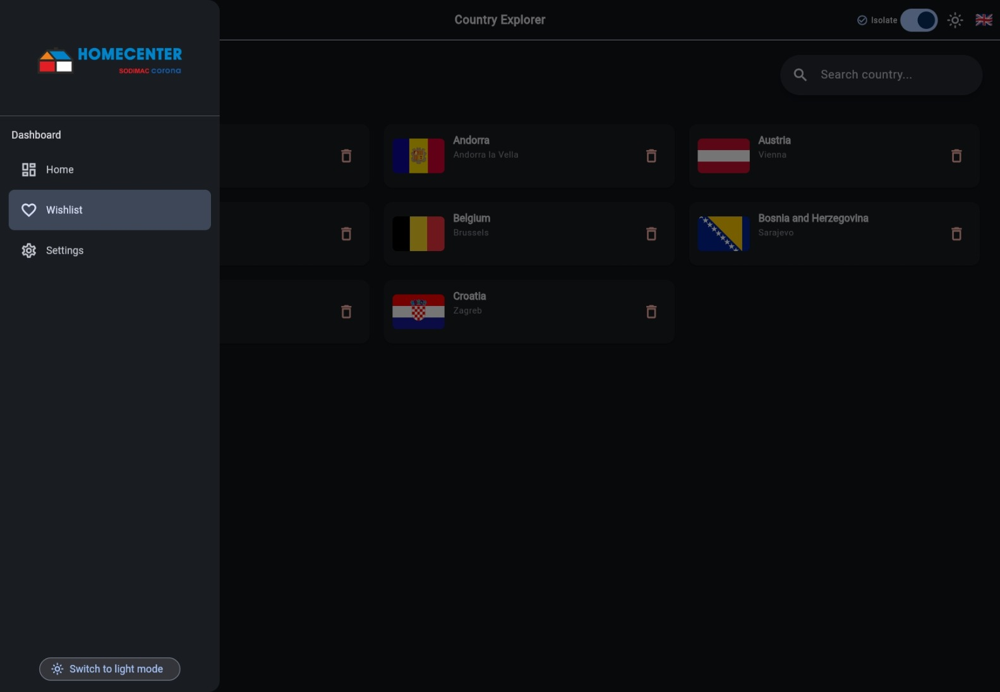
</p>

## Stack tecnológico

- Clean Architecture (por feature)
- Melos (monorepo management)
- BLoC (flutter_bloc) + hydrated_bloc
- go_router
- GetIt / Injectable
- freezed + json_serializable
- Dio (HTTP Client) + interceptores
- Exception Handling (Custom Error Management)
- Drift (SQLite – web & mobile)
- Performance Optimization (Jank Detection & Prevention)
- easy_localization
- adaptive_theme
- bot_toast
- cached_network_image

## Clean Architecture

Cada feature implementa Clean Architecture con tres capas:

- **Presentation**: UI, BLoC (states/events/cubit)
- **Domain**: Use cases, entities, repository interfaces
- **Data**: Repository implementations, datasources (remote & local), models

<br>
<p align="center">

</p>

## Estructura del monorepo

```
flutter_wigilabs_sr/            # Workspace raíz (Melos)
├── apps/
│   ├── client-app/             # Explorador de países de Europa
│   │   ├── lib/
│   │   │   ├── main.dart
│   │   │   ├── app.dart
│   │   │   └── config/
│   │   │       ├── database/    # Drift: AppDatabase (WishlistTable)
│   │   │       ├── env/         # Flavors + Envied (dev/qa/prod)
│   │   │       ├── injectable/  # DI con GetIt
│   │   │       ├── routes/      # go_router
│   │   │       └── theme/       # Temas claro/oscuro
│   │   └── web/                 # Entrypoints y assets web
│   └── financial-app/          # Gestión de Fondos BTG (FPV/FIC)
│       ├── lib/
│       │   ├── main.dart
│       │   ├── app.dart
│       │   └── config/
│       │       ├── database/    # Drift: FinancialAppDatabase (FundsDatabase)
│       │       ├── env/         # Flavors + Envied (dev/qa/prod)
│       │       ├── injectable/  # DI con GetIt
│       │       ├── routes/      # go_router
│       │       └── theme/       # Temas claro/oscuro
│       └── web/                 # Entrypoints y assets web
├── packages/
│   ├── core/                    # Capa compartida entre features
│   │   └── lib/
│   │       ├── constants/       # Constantes globales
│   │       ├── database/        # Drift: conexión web/mobile + WishlistTable
│   │       ├── entities/        # Entidades globales (CountryEntity…)
│   │       ├── enum/            # Enums compartidos
│   │       ├── env/             # Interfaz IEnvConfig
│   │       ├── errors/          # Failures y manejo de errores
│   │       ├── network/         # Cliente Dio e interceptores
│   │       ├── performance/     # Detección de janks
│   │       └── utils/
│   │           └── isolates/    # CountryIsolateUtils (compute)
│   ├── components/              # Widgets reutilizables y temas
│   └── features/
│       ├── client-app/          # Features de client-app
│       │   ├── home/            # Listado y detalle de países
│       │   ├── wishlist/        # Lista de deseos (favoritos)
│       │   └── settings/        # Idioma, tema y performance toggle
│       └── financial-app/       # Features de financial-app
│           └── funds/           # Fondos BTG: suscripción, cancelación, historial
│               └── lib/
│                   ├── data/
│                   │   ├── datasources/
│                   │   └── repository/
│                   ├── domain/        # Entidades, use cases, interfaces
│                   └── presentation/  # BLoC + vistas responsive
├── scripts/
│   ├── setup_web.sh/.ps1        # Configura sqlite3.wasm y drift worker
│   └── check_coverage.sh/.ps1   # Verifica umbral de cobertura
└── codemagic.yaml               # CI/CD para Codemagic
```

## Cómo ejecutar

Necesitas [Flutter](https://flutter.dev/docs/get-started/install) y [Melos](https://melos.invertase.dev) instalados.

```bash
# 1. Clonar el repositorio
git clone https://github.com/andresroviram/flutter_wigilabs_sr.git
cd flutter_wigilabs_sr

# 2. Instalar Melos (si no lo tienes)
dart pub global activate melos

# 3. Bootstrap del workspace (instala dependencias de todos los packages)
melos bootstrap

# 4. Crear los archivos de entorno por flavor (basados en el template)
cp apps/client-app/.env.example apps/client-app/.env.dev
cp apps/client-app/.env.example apps/client-app/.env.qa
cp apps/client-app/.env.example apps/client-app/.env.prod
cp apps/financial-app/.env.example apps/financial-app/.env.dev
cp apps/financial-app/.env.example apps/financial-app/.env.qa
cp apps/financial-app/.env.example apps/financial-app/.env.prod
# Edita cada archivo con las URLs y API keys correspondientes

# 5. Generar código (build_runner lee los 3 archivos .env.* a la vez)
melos run build:all

# 6a. Ejecutar client-app con el flavor deseado
cd apps/client-app
flutter run --dart-define=FLAVOR=dev    # DEV  – banner verde
flutter run --dart-define=FLAVOR=qa     # QA   – banner naranja
flutter run --dart-define=FLAVOR=prod   # PROD – sin banner

# 6b. Ejecutar financial-app
melos run run:financial:web     # Chrome puerto 4002
melos run run:financial:mobile  # iOS/Android
melos run run:financial:desktop # macOS
```

> **Nota:** El `--dart-define=FLAVOR` selecciona qué variables de entorno usa la app en runtime. `build_runner` genera código obfuscado para los 3 entornos simultáneamente; no es necesario regenerar al cambiar de flavor.

### Configuración web (Drift + SQLite) - Esto es Opcional

Antes de ejecutar en web por primera vez:

```bash
# Linux/macOS
chmod +x scripts/setup_web.sh
./scripts/setup_web.sh

# Windows
.\scripts\setup_web.ps1
```

## Scripts de Melos

| Comando                            | Descripción                                           |
|------------------------------------|-------------------------------------------------------|
| `melos bootstrap`                  | Instala dependencias de todos los packages            |
| `melos run build:all`              | Genera código en orden secuencial (core → features → apps) |
| `melos run build:feature_funds`    | Genera código en feature_funds (Drift + injectable)   |
| `melos run build:financial-app`    | Genera código en financial-app (injectable, envied)   |
| `melos run build:web-worker`       | Recompila drift worker de client-app                  |
| `melos run build:web-worker:financial` | Recompila drift worker de financial-app           |
| `melos run build:watch`            | build_runner en modo watch                            |
| `melos run format`                 | Verifica formato (excluye archivos generados)          |
| `melos run format:fix`             | Aplica formato (excluye archivos generados)            |
| `melos run analyze`                | Análisis estático en todos los packages               |
| `melos run analyze:changed`        | Análisis solo de packages modificados vs main         |
| `melos run test`                   | Ejecuta todos los tests                               |
| `melos run test:coverage`          | Tests con reporte de cobertura                        |
| `melos run test:changed`           | Tests solo de packages modificados vs main            |
| `melos run clean:generated`        | Elimina archivos .g.dart y .freezed.dart              |
| `melos run ci`                     | Pipeline completo: analyze + format + test            |
| `melos run run:mobile`             | Lanza client-app en iOS/Android                       |
| `melos run run:web`                | Lanza client-app en Chrome (puerto 4000)              |
| `melos run run:desktop`            | Lanza client-app en macOS Desktop                     |
| `melos run run:financial:mobile`   | Lanza financial-app en iOS/Android                    |
| `melos run run:financial:web`      | Lanza financial-app en Chrome (puerto 4002)           |
| `melos run run:financial:desktop`  | Lanza financial-app en macOS Desktop                  |

## Flavors

Ambas apps soportan tres entornos configurados con `--dart-define=FLAVOR`:

| Flavor | Rama | Banner | Uso |
|--------|------|--------|-----|
| `dev`  | `develop` | 🟢 Verde | Desarrollo local |
| `qa`   | `main` | 🟠 Naranja | Quality Assurance |
| `prod` | `release/*` | Sin banner | Producción |

Cada app tiene sus propios archivos de entorno:

| Archivo | Leído por |
|---------|----------|
| `apps/client-app/.env.dev` | `EnvDev` (client-app) |
| `apps/client-app/.env.qa` | `EnvQa` (client-app) |
| `apps/client-app/.env.prod` | `EnvProd` (client-app) |
| `apps/financial-app/.env.dev` | `EnvDev` (financial-app) |
| `apps/financial-app/.env.qa` | `EnvQa` (financial-app) |
| `apps/financial-app/.env.prod` | `EnvProd` (financial-app) |

`build_runner` genera los 3 entornos obfuscados en `env.g.dart` de una sola vez. El `--dart-define=FLAVOR` selecciona cuál usar en runtime sin necesidad de regenerar código.

## CI/CD & Despliegue

El proyecto tiene dos sistemas de CI/CD en paralelo:

### 🔄 GitHub Actions (legacy)

Workflows en `.github/workflows/` para CI, web, Android e iOS con Fastlane.

### 🚀 Codemagic (`codemagic.yaml`)

Pipeline principal con soporte nativo de flavors. Estrategia de ramas → flavor:

| Rama | Flavor | Android | iOS | Web |
|------|--------|---------|-----|-----|
| `develop` | DEV | Google Play internal | TestFlight interno | Artefacto |
| `main` | QA | Google Play alpha | TestFlight externo | — |
| `release/*`, `v*` | PROD | Google Play production | App Store | GitHub Pages |

#### Workflows disponibles

| Workflow | Descripción |
|----------|-------------|
| `ci` | Analyze, format & test en todas las ramas |
| `android-dev` | AAB firmado → Google Play internal (develop) |
| `android-qa` | AAB firmado → Google Play alpha (main) |
| `android-prod` | AAB firmado → Google Play production (release/*) |
| `ios-dev` | IPA firmado → TestFlight interno (develop) |
| `ios-qa` | IPA firmado → TestFlight externo (main) |
| `ios-prod` | IPA firmado → App Store (release/*) |
| `web-dev` | Build web DEV (develop) |
| `web-prod` | Build web + GitHub Pages (main / release/*) |

#### Grupos de secretos en Codemagic

Crear en **App Settings → Environment variables**:

| Grupo | Variables |
|-------|-----------|
| `env_dev` | `DEV_BASE_URL`, `DEV_API_KEY` |
| `env_qa` | `QA_BASE_URL`, `QA_API_KEY` |
| `env_prod` | `PROD_BASE_URL`, `PROD_API_KEY` |
| `android_signing` | `ANDROID_KEYSTORE_BASE64`, `KEYSTORE_PASSWORD`, `KEY_ALIAS`, `KEY_PASSWORD` |
| `google_play` | `PLAY_STORE_SERVICE_ACCOUNT_JSON` |
| `ios_signing` | `APP_STORE_CONNECT_PRIVATE_KEY`, `APP_STORE_CONNECT_API_KEY_ID`, `APP_STORE_CONNECT_ISSUER_ID` |
| `github_pages` | `GITHUB_TOKEN`, `GITHUB_REPO_FULL_NAME` |
| `codecov` | `CODECOV_TOKEN` |

## Features

### client-app – Explorador de países
- 🌍 Explorador de países de Europa
- 🔍 Búsqueda y filtrado de países
- ❤️ Lista de deseos (wishlist) con persistencia local
- 💾 Almacenamiento local con Drift (SQLite – web & mobile)
- 🌐 Soporte multi-idioma (Español/Inglés)
- 🎨 Tema claro/oscuro adaptativo
- 📱 Diseño responsive (Mobile, Tablet, Web, Desktop)
- ⚡ Caché de imágenes
- 🔄 Manejo de estados con BLoC
- 🌐 Peticiones HTTP con Dio e interceptores
- ⚠️ Manejo robusto de excepciones y errores
- 🚀 Optimización de performance (detección y prevención de janks con isolates)

### financial-app – Gestión de Fondos BTG
- 💼 Visualización de fondos disponibles (FPV/FIC)
- ✅ Suscripción a fondos con validación de saldo mínimo
- ❌ Cancelación de suscripciones con devolución de saldo
- 📋 Historial de transacciones (suscripciones y cancelaciones)
- 🔔 Selección de método de notificación (email o SMS)
- 💰 Saldo inicial de COP $500.000 persistido en Drift
- ⚠️ Mensajes de error claros ante saldo insuficiente
- 📱 Diseño responsive (Mobile y Web)
